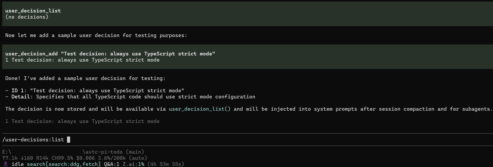
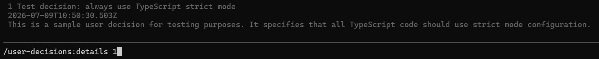

# avtc-pi-user-decisions

Captures user decisions and re-injects them into the system prompt after compaction and into subagents, so the agent never forgets a decision you made.

## Features

- **Survives compaction**: decisions are written to a session-scoped store and re-injected into the system prompt on every turn
- **Shared with subagents**: the root session publishes its store path via an env-var cascade, so every subagent reads and writes the same store
- **Three capture modes**: `agent` (manual tools, zero LLM), `background` (passive auto-catch LLM pipeline), and `none` (disabled) — selectable via `captureMode`
- **Ranked or append storage**: value-ranked and bounded (`rankingEnabled: true`), or arrival-order and unbounded (`rankingEnabled: false`)
- **Supersede support**: a new decision can replace earlier ones; the old records move to `dropped` and the new record carries back-references
- **Force-enabled in subagents**: the decision tools are force-added into subagent ([`avtc-pi-subagent`](https://github.com/avtc/avtc-pi-subagent)) sessions

## Installation

```bash
pi install npm:avtc-pi-user-decisions
```

## Configuration

Settings are managed via the `/user-decisions:settings` command (an interactive modal) and persisted to settings files. Project-level keys override global-level keys (per-key present-wins). Invalid values fall back to their default and are logged.

| File | Path |
|------|------|
| Global | `~/.pi/agent/avtc-pi-user-decisions-settings.json` |
| Project | `<cwd>/.pi/avtc-pi-user-decisions-settings.json` |

Both files are flat JSON (no nested section). Project keys override global keys only when explicitly set. Settings are serialized to the `PI_SETTINGS_USER_DECISIONS` env var so subagent child processes inherit the parent's settings. Re-read on `/reload`.

| Key | Type | Default | Description |
|-----|------|---------|-------------|
| `captureMode` | string | `"agent"` | Capture mode: `"agent"` (agent records decisions using tools), `"background"` (auto-catch LLM pipeline), `"none"` (disabled) |
| `rankingEnabled` | boolean | `true` | Rank decisions by value (3-tier, bounded at `limit`) vs append by recency (2-tier, unbounded; inject most-recent `limit`) |
| `injectIntoSystemPromptEnabled` | boolean | `true` | Inject user-decisions into the system prompt on subagent session start and after compaction |
| `limit` | number | `100` | When ranked: the active-store bound (top decisions kept). When not ranked: the most-recent count injected (storage stays unbounded) |
| `backgroundCaptureModel` | string \| null | `null` | Model for the background auto-catch as `provider/id`. `null` = session model. Inert unless `captureMode: "background"`. |
| `backgroundRetries` | number | `3` | How many times to retry a failed background capture before asking whether to keep retrying or pause |
| `backgroundThinkingLevel` | string | `"low"` | Thinking level for auto-catch user-decisions: `"off"`, `"minimal"`, `"low"`, `"medium"`, `"high"`, `"xhigh"` |
| `backgroundMaxTokens` | number | `8192` | Max output tokens per background capture LLM call |
| `backgroundCallTimeoutMs` | number | `180000` | Per-call timeout in ms that aborts a background capture LLM call if it hangs (e.g. `180000` = 3 minutes; human strings like `"3m"` also accepted) |
| `backgroundCaptureDumpLimit` | number | `30` | Max debug dump files kept under `<cwd>/.pi/user-decisions/debug/` (oldest pruned). Only written in `background` mode. |

Example global `~/.pi/agent/avtc-pi-user-decisions-settings.json`:

```json
{
  "captureMode": "agent",
  "backgroundCaptureModel": null,
  "rankingEnabled": true,
  "injectIntoSystemPromptEnabled": true,
  "limit": 100,
  "backgroundRetries": 3,
  "backgroundThinkingLevel": "low",
  "backgroundMaxTokens": 8192,
  "backgroundCallTimeoutMs": 180000,
  "backgroundCaptureDumpLimit": 30
}
```

Example project `<cwd>/.pi/avtc-pi-user-decisions-settings.json` (project keys override; the rest inherit from global):

```json
{
  "captureMode": "background",
  "backgroundCallTimeoutMs": 180000,
  "backgroundCaptureDumpLimit": 30
}
```

## Storage

Decisions are stored per session under `<cwd>/.pi/user-decisions/sessions/<sessionId>.jsonl`. `<sessionId>` is the pi session id (stable across `/reload` and `/resume`). The store is shared with subagents, so they read and write the same decisions.

## Tools

`user_decision_add` is registered in `agent` mode only (the write tool). `user_decision_list` and `user_decision_detail` are registered in both `agent` and `background` modes (read-only). They operate on the session store; writes take the lock and do **not** refresh the injection cache (that happens on `session_start` / `session_compact`).

| Tool | Description |
|------|-------------|
| `user_decision_add` | Persist a user decision. It survives compaction and is propagated to subagents. A decision can supersede earlier decisions. Supplies `summary`, optional `detail`, optional `beforeId` (ranked only — insert before this id), and optional `supersedes` (ids this replaces). Agent-driven — **no LLM**. |
| `user_decision_list` | Recall summarized decisions with a substring `filter`, optional `status` (`live` / `dropped` / `all`; omit = `live`), and optional `limit`. Results are value-ordered (ranked) or most-recent-first (append). |
| `user_decision_detail` | Recall a decision's full record by `id`, searching all tiers — always returns the complete record including status and `supersededBy`. |

`user_decision_add` parameter schemas are config-aware: `beforeId` is only present when `rankingEnabled` (no positioning exists in append mode).

## How It Works

- **`agent` mode** — the agent records decisions itself by calling `user_decision_add` during its turn (no separate capture step).
- **`background` mode** — each agent→user exchange (the agent's last message or question and your reply) is examined, and decisions worth keeping are extracted and added automatically.
- Your decisions are injected into the agent's context and shared with its subagents, so they survive compaction.

Background capture runs off the conversation turn. On repeated failure it offers to pause (`/user-decisions:pause` / `/user-decisions:resume`); the queue is kept, so capture resumes without loss.

## Commands

Slash commands let the user browse the session store directly. They are read-only, use the same rendering as the `user_decision_*` tools (so list/detail look identical for agent and user), and are available in `agent` and `background` modes. Root session only (the store is root-session-scoped; subagents get the tools via the extra-tools contributor).

| Command | Description |
|---------|-------------|
| `/user-decisions:settings` | Open the settings modal (capture mode, ranking, injection, background pipeline). |
| `/user-decisions:list [substring]` | List live decisions, ordered per `rankingEnabled`. Optional case-insensitive `substring` filters across summary and detail. |
| `/user-decisions:details {id}` | Show a decision's full record by `id`. |
| `/user-decisions:pause` | Pause auto-processing of captured user decisions. |
| `/user-decisions:resume` | Resume auto-processing of captured user decisions. |

Output is shown via `ui.notify`.

Inspect captured decisions via slash commands:





## Debugging

Background mode (`captureMode: "background"`) keeps two best-effort trails for diagnosing capture/LLM hangs:

- **Logs** — `~/.pi/logs/avtc-pi-user-decisions/<YYYY-MM-DD>.log` (per-module scopes: `queue`, `capture`, `extract`, `build`, `llm`). Capture enqueue/drain, extract+build phase boundaries, LLM attempt+result with throttled token progress, retries, and exhaustion. Set `PI_LOGGER_DIR` to relocate the log root.
- **Dump files** — one per capture at `<cwd>/.pi/user-decisions/debug/capture-*.txt`, capturing the exact extract input/output and build input/output. Pruned to the last `backgroundCaptureDumpLimit` (default 30).

Both are written only while a capture runs, so a no-decision session leaves no trace beyond the empty store.

## Full suite

Check out the full suite of related extensions, [avtc-pi](https://github.com/avtc/avtc-pi) — deterministic feature development, subagent delegation, working-memory, behavioral learning, parallel-work guardrails, durable decisions, notifications, and more.

Developed with [Z.ai](https://z.ai/subscribe?ic=N5IV4LLOOV) — get 10% off your subscription via this referral link.

## License

MIT
